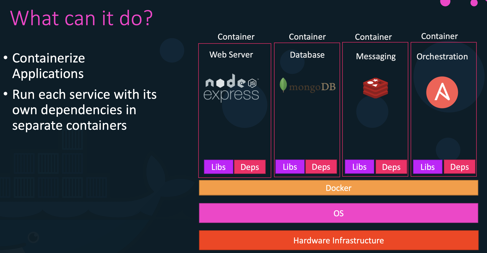
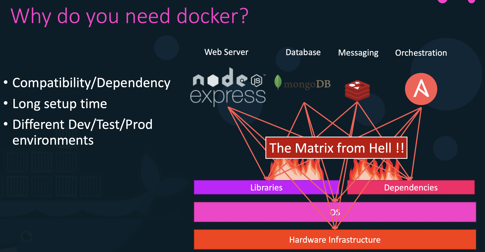
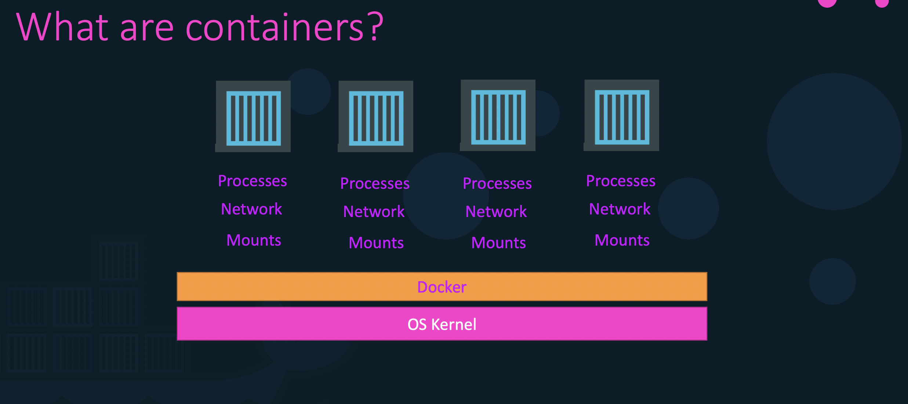
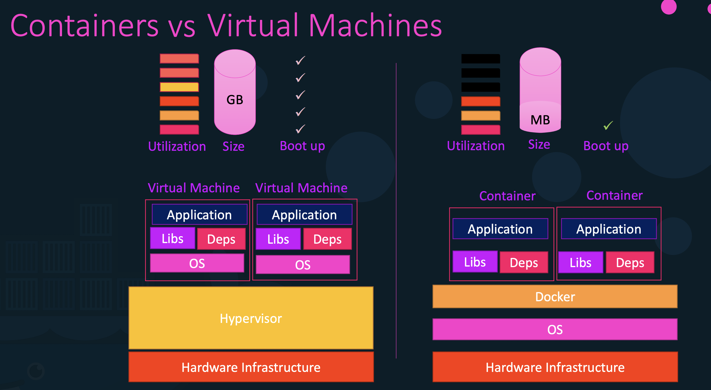
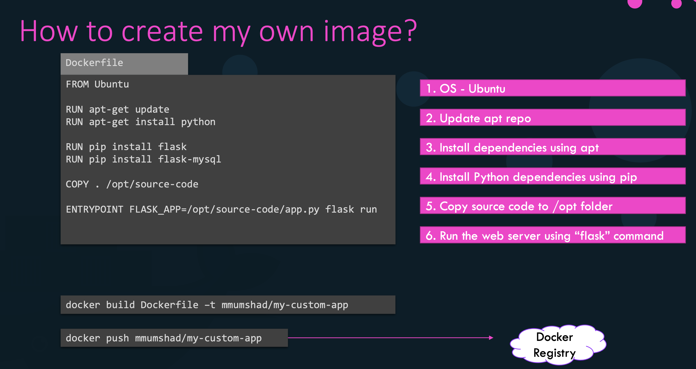
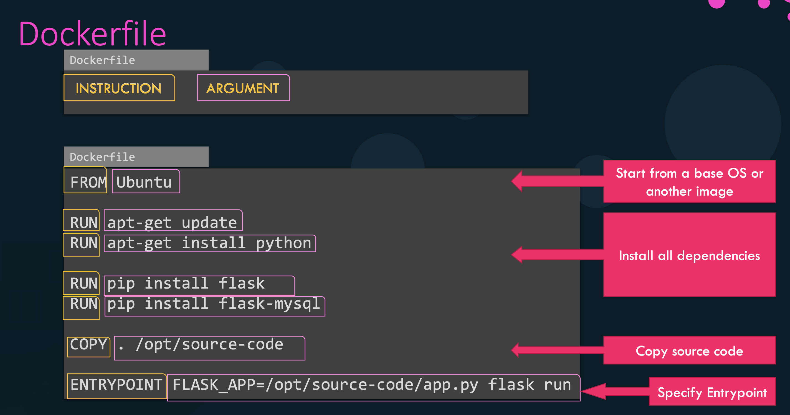
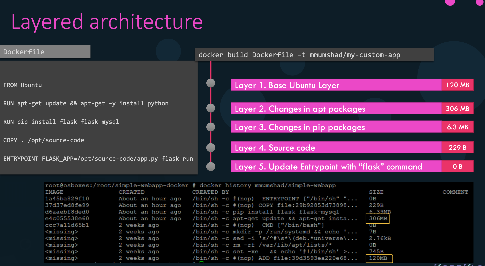
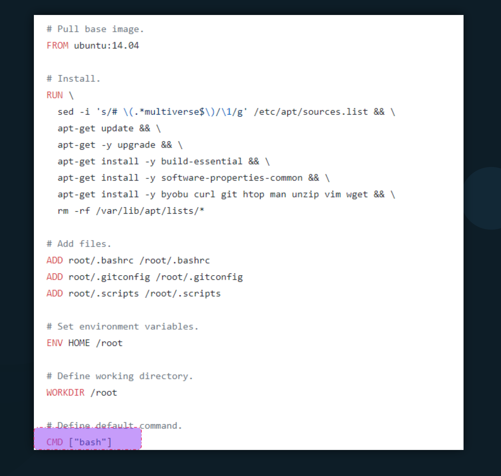
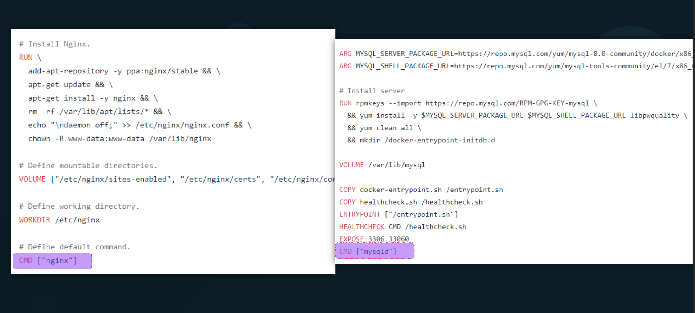

# Docker

This repository contains documentation for Docker. This is good for beginners who want to learn docker.

In this repository, you will have a basic understanding of docker and its commands. You will also learn how to run a container in detached mode, interactive mode, and how to map ports.

I have also added some sample queries which will help you to understand the docker commands.

For testing your knowledge, I have added some tasks. You can try to solve them.

If you have any suggestions or queries, feel free to contact me on [LinkedIn](https://www.linkedin.com/in/sanket-joshi-63b074144/) or make a pull request.

For all Task Solutions, please refer to [Task Solutions](./Task%20Soluitions.md).
Cheers and happy learning!

## What is Docker?

Docker is a tool designed to make it easier to create, deploy, and run applications by using containers. Containers allow a developer to package up an application with all of the parts it needs, such as libraries and other dependencies, and deploy it as one package.



## Why you need Docker?

Docker is a tool that allows developers, sys-admins etc. to easily deploy their applications in a sandbox (called containers) to run on the host operating system i.e. Linux. The key benefit of Docker is that it allows users to package an application with all of its dependencies into a standardized unit for software development. Unlike virtual machines, containers do not have the high overhead and hence enable more efficient usage of the underlying system and resources.


## Terminology

- **Docker Container**: Docker Container is an isolated environment that runs on top of the host operating system.They can have there own process, network interfaces, mounts etc except for the kernel.Docker container is simply an instance of a Docker image. It is a lightweight, standalone, executable package of software that includes everything needed to run an application: code, runtime, system tools, system libraries and settings.
  
- **Docker Image**: The file system and configuration of an application which are used to create Docker containers. Docker images are built from layers of other images. Docker images are stored in a Docker registry.
- **Docker Host/Docker Engine**: The physical or virtual machine on which Docker is installed. Docker Engine runs on the Docker host.
- **Docker Daemon**: The background service running on the host that manages building, running and distributing Docker containers.
- **Docker Client**: The command line tool that allows the user to interact with the Docker daemon.
- **Docker Registry**: A Docker registry is a repository for Docker images. Docker clients connect to registries to download (“pull”) images for use or upload (“push”) images that they have built.
- **Dockerfile**: Dockerfile is a text-based script that contains all the commands a user could call on the command line to assemble an image.
- **Docker Compose**: Docker Compose is a tool for defining and running multi-container Docker applications. With Compose, you use a YAML file to configure your application’s services.

## Docker vs Virtual Machine

| Docker                              | Virtual Machines                                               |
| ----------------------------------- | -------------------------------------------------------------- |
| Containers are much lighter         | Need to emulate an operating system or hardware virtualization |
| Containers are portable             | Virtual machines are not portable                              |
| Containers are faster to start      | Virtual machines are slower to start                           |
| Containers are more flexible        | Virtual machines are less flexible                             |
| Containers share the host OS kernel | Virtual machines have their own OS kernel                      |
| Containers are less secure          | Virtual machines are more secure                               |



## Docker Installation

### Install Docker on Ubuntu

```bash
sudo apt-get update
sudo apt-get install docker-ce docker-ce-cli containerd.io
```

### Install Docker on CentOS

```bash
sudo yum install -y yum-utils device-mapper-persistent-data lvm2
sudo yum-config-manager --add-repo https://download.docker.com/linux/centos/docker-ce.repo
sudo yum install docker-ce docker-ce-cli containerd.io
```

### Install Docker on Debian

```bash
sudo apt-get update
sudo apt-get install apt-transport-https ca-certificates curl gnupg2 software-properties-common
sudo apt-get install docker-ce docker-ce-cli containerd.io
```

## Docker Commands

| Name |Description |Syntax | Example | Extra Info |
| --- | --- | --- | --- | --- |
| **docker run** | Run a command in a new container | `docker run [OPTIONS] IMAGE [COMMAND] [ARG...]` | `docker run -it ubuntu bash` | If the image is not availble then it will pull from docker hub |
| **docker ps** | List containers | `docker ps [OPTIONS]` | `docker ps -a` | -a: Show all containers (default shows just running) |
| **docker stop** | Stop one or more running containers | `docker stop [OPTIONS] CONTAINER [CONTAINER...]` | `docker stop 1a2b3c4d5e6f` | -t: Seconds to wait for stop before killing it (default 10) |
| **docker rm** | Remove one or more containers | `docker rm [OPTIONS] CONTAINER [CONTAINER...]` | `docker rm 1a2b3c4d5e6f` | -f: Force the removal of a running container (uses SIGKILL) |
| **docker images** | List images | `docker images [OPTIONS] [REPOSITORY[:TAG]]` | `docker images` | -a: Show all images (default hides intermediate images) |
| **docker rmi** | Remove one or more images | `docker rmi [OPTIONS] IMAGE [IMAGE...]` | `docker rmi 1a2b3c4d5e6f` | -f: Force removal of the image |
| **docker pull** | Pull an image or a repository from a registry | `docker pull [OPTIONS] NAME[:TAG|@DIGEST]` | `docker pull ubuntu` |
| **docker exec** | Run a command in a running container | `docker exec [OPTIONS] CONTAINER COMMAND [ARG...]` | `docker exec -it 1a2b3c4d5e6f bash` | -i: Keep STDIN open even if not attached -t: Allocate a pseudo-TTY |
| **docker inspect** | Return low-level information on Docker objects | `docker inspect [OPTIONS] NAME|ID [NAME|ID...]` | `docker inspect 1a2b3c4d5e6f` | -f: Format the output using the given Go template |
| **docker logs** | Fetch the logs of a container | `docker logs [OPTIONS] CONTAINER` | `docker logs 1a2b3c4d5e6f` | -f: Follow log output -t: Show timestamps |

## Run container in background

By default, docker run command runs a container in foreground. To run a container in background, use -d option.

```bash
docker run -d ubuntu sleep 1000
```

## Run container in interactive mode

To run a container in interactive mode, use -it option.

```bash
docker run -it ubuntu bash
```

## Task 001

- [ ] Run a ubuntu container in detached mode and check the version of ubuntu installed.
- [ ] Run a Ngix container in detached mode and map port 80 on the container to port 8080 on the host.
- [ ] Run multiple instance of Nginx on same container port and see what you observe.
- [ ] Pull the latest version of the centos image and run a container in interactive mode, then execute a shell (e.g., /bin/bash) inside the container. Explore the CentOS environment from within the container.
- [ ] Run a MySQL container in detached mode, set the environment variables for the root password and database name, and expose port 3306 on the container. Connect to the MySQL server from your host machine using a MySQL client.
- [ ] Run a WordPress container in detached mode, using environment variables to configure the database connection. Access the WordPress web application in your web browser and complete the initial setup.

## Docker Images

Docker Images are the building blocks of Docker containers. In other words, Docker container is simply an instance of a Docker image. It is a lightweight, standalone, executable package of software that includes everything needed to run an application: code, runtime, system tools, system libraries and settings.

But before you start you need to ask yourself a question, What am I containerizing? Is it a web application, a database, a web server, or something else? Once you have the answer to this question, you can start building your Docker image.

For Instance in case you want to deploy simple html on NGINX web server,think about the following:

- What is the base image I need to use?
- What are the dependencies I need to install?
- What are the commands I need to run to install the dependencies?
- What are the commands I need to run to start the web server?
- What port do I need to expose?
- How do I copy the html files to the container?

### How to create your own Docker Image?

To create your own Docker image, you need to create a Dockerfile. A Dockerfile is a text-based script that contains all the commands a user could call on the command line to assemble an image.

To create a Dockerfile, you need to create a file named Dockerfile with no extension. The Dockerfile contains all the instructions needed to create a new image.

### Dockerfile Instructions

| Instruction | Description |
| --- | --- |
| FROM | Sets the Base Image for subsequent instructions. |
| MAINTAINER | Set the Author field of the generated images. |
| RUN | Execute any commands in a new layer on top of the current image and commit the results. |
| CMD | Provide defaults for an executing container. |
| EXPOSE | Informs Docker that the container listens on the specified network ports at runtime. |
| ENV | Sets environment variable. |
| ADD | Copies new files, directories or remote file to container. Invalidates caches. |
| COPY | Copies new files or directories to container. By default this copies as root regardless of the USER/WORKDIR settings. Use --chown=<user>:<group> to give ownership to another user/group. |
| ENTRYPOINT | Configures a container that will run as an executable. |
| VOLUME | Creates a mount point for externally mounted volumes or other containers. |
| USER | Sets the user name for following RUN / CMD / ENTRYPOINT commands. |
| WORKDIR | Sets the working directory. |
| ARG | Defines a build-time variable. |



On the left side, you can see the Dockerfile instructions and on the right side, you can see arguments for each instruction.



### Layered Architecture

Docker images are built from layers of other images. A Dockerfile starts with a base image. Each instruction in the Dockerfile creates a new layer in the image. Each layer is only a set of differences from the layer before it. The layers are stacked on top of each other. When you create a new container, you add a new writable layer on top of the underlying layers. This layer is often called the “container layer”. All changes made to the running container, such as writing new files, modifying existing files, and deleting files, are written to this thin writable container layer.



### Build Docker Image

To build a Docker image, you need to run the docker build command. The docker build command builds Docker images from a Dockerfile and a “context”. A build’s context is the set of files located in the specified PATH or URL. The build process can refer to any of the files in the context. For example, your build can use a COPY instruction to reference a file in the context.

```bash
docker build .
```

Explanation: The above command will build an image from the Dockerfile in the current directory and tag the image as latest.

### Task 002

- [ ] Check the index.html from Task002_files folder.
- [ ] Create a Dockerfile use ubuntu as base image.
- [ ] Install nginx on the image.
- [ ] Expose port 80 on the container.
- [ ] Before going further, build the image and run the container to check if everything is working fine till here.
- [ ] Run the docker container in detached mode and map port 80 on the container to port 8080 on the host and check if you are able to view default nginx page on your browser.
- [ ] Now Modify the dockerfile to copy the index.html file to the container at /usr/share/nginx/html location.
- [ ] Build the image and run the container in detached mode and map port 80 on the container to port 8080 on the host and check if you are able to view the index.html page on your browser.

### Environment Variables

Environment variables are a set of dynamic named values that can affect the way running processes will behave on a computer. For example, a running process can query the value of the TEMP environment variable to discover a suitable location to store temporary files, or the HOME or USERPROFILE variable to find the directory structure owned by the user running the process.

#### How to set Environment Variables?

To set environment variables, you need to use ENV instruction in Dockerfile.

```bash
docker run -e ENVIRONMENT_VARIABLE_NAME=VALUE Environment_Variable_Name Image_Name
```

#### How to use Environment Variables?

To use environment variables, you need to use $ENVIRONMENT_VARIABLE_NAME in Dockerfile.

```bash
ENV ENVIRONMENT_VARIABLE_NAME=VALUE
```

#### How to pass secure environment variables?

To pass secure environment variables, you need to use --env-file option in docker run command.

```bash
docker run --env-file=ENVIRONMENT_VARIABLE_FILE_NAME Image_Name
```

##### Environment Variable File

Environment variable file is a text file containing environment variables in the form of key-value pair.

```bash
ENVIRONMENT_VARIABLE_NAME=VALUE
ENVIRONMENT_VARIABLE_NAME2=VALUE2
#This is a comment
```

#### How to check environment variables in a container?

To check environment variables in a container, you need to use docker inspect command.

```bash
docker inspect CONTAINER_NAME
```

```bash
docker exec container env
```

### Task 003

- [ ] Run a container named blue-app using image kodekloud/simple-webapp and set the environment variable APP_COLOR to blue. Make the application available on port 38282 on the host. The application listens on port 8080
- [ ] Deploy a mysql database using the mysql image and name it mysql-db.Set the database password to use db_pass123. Lookup the mysql image on Docker Hub and identify the correct environment variable to use for setting the root password.

### Command and Entrypoint

Unlike Virtual Machines, Docker containers do not meant to host an operating system. They are meant to host an specific task such as a web server, a database server, a web application etc.

So if you run ubuntu container,it defaults to run bash shell. By default bash does not run as a service. So if you run ubuntu container in detached mode, it will exit immediately.

Look at last command in the below image.


Where as if you run nginx container or mysql container, it will run as a service. So if you run nginx container in detached mode, it will not exit immediately.

Look at last command in the below image.


So how do you speicify different commands to run when you run a container?

You have to override the default command while running the container.

```bash
docker run ubuntu sleep 1000
```

in the above command, we are overriding the default command with sleep 1000.

or second option is to use ubuntu as base image and specify the command in Dockerfile.

```bash
FROM ubuntu
CMD sleep 1000
#OR CMD ["sleep","1000"]
```

But now what if you want to sleep the container for 10 seconds instead of 1000 seconds?

You have to run another container with different command.

```bash
docker run ubuntu sleep 10
```

But this is not the ideal way to do it. You have to use ENTRYPOINT instruction in Dockerfile.

Entrypoint instruction allows you to specify the command to run when the container starts.

```bash
FROM ubuntu
ENTRYPOINT ["sleep"]
```

now to run the container for 10 seconds, you have to run the container as below.

```bash
docker run ubuntu 10
```

In case of CMD line instruction it will get replaced by the command you specify while running the container but in case of ENTRYPOINT instruction it will append the command you specify while running the container.

Now think what will happen if you don't pass the argument while running the container?

```bash
docker run ubuntu
```

It will throw the error as below.

```bash
sleep: missing operand
```

To fix this you will use both CMD and ENTRYPOINT instruction in Dockerfile.

```bash
FROM ubuntu
ENTRYPOINT ["sleep"]
CMD ["1000"]
```

#### CMD Instruction

CMD in Dockerfile defines the default executable of a Docker image. It can be overridden by passing an argument to docker run command.

#### ENTRYPOINT Instruction

ENTRYPOINT is one of the many instructions you can write in a dockerfile. The ENTRYPOINT instruction is used to configure the executables that will always run after the container is initiated. It is similar to CMD instruction, but it cannot be overridden by passing an argument to docker run command.

#### CMD VS ENTRYPOINT

| CMD | ENTRYPOINT |
| --- | --- |
| CMD instruction is used to provide default values for the executing container. | ENTRYPOINT instruction is used to configure the executables that will always run after the container is initiated. |
| CMD instruction can be overridden by passing an argument to docker run command. | ENTRYPOINT instruction cannot be overridden by passing an argument to docker run command. |
| CMD instruction can be used multiple times in a Dockerfile. | ENTRYPOINT instruction can be used only once in a Dockerfile. |

### Task 004

- [ ] Go to Project/Backend and build the docker image using Dockerfile. listen to any port that is available on the host.
but container should listen on port 80. try to access the application endpoint from the host /docs.

## Sample Queries

1- Count the number of running containers.

```bash
docker ps | wc -l
```

wc -l counts the number of lines in the output of docker ps command.

2- Remove all containers.

```bash
docker stop $(docker ps -a -q)
docker rm $(docker ps -a -q)
```

Explanation: docker ps -a -q lists all containers and docker stop stops all containers. Similarly, docker rm removes all containers.

3- Remove all images.

```bash
docker stop $(docker ps -a -q)
docker rm $(docker ps -a -q)
docker rmi $(docker images -q)
```

Explanation: docker images -q lists all images and docker rmi removes all images.

4- Run an instance of kodekloud/simple-webapp with a tag blue and map port 8080 on the container to 38282 on the host.

```bash
docker run -d -p 38282:8080 kodekloud/simple-webapp:blue
```

5- How to name docker container?

```bash
docker run --name CONTAINER_NAME IMAGE_NAME
```
